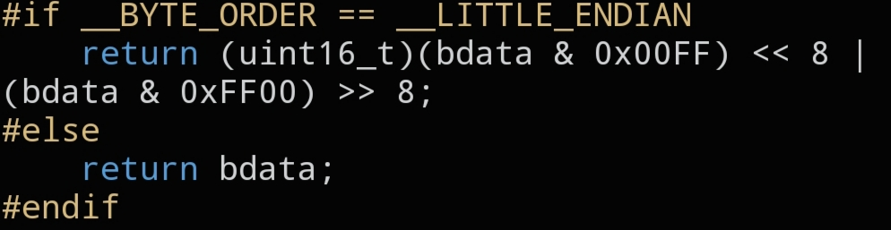

# `CNET_BIG16`

```c
static inline uint16_t CNET_BIG16(uint16_t bdata);
```



## Description

Converts a 16-bit value to Big Endian (network byte order). On a big-endian host this is a no-op; on a little-endian host the two bytes are swapped. Use it for any 16-bit protocol field (ports, lengths, IDs, ...).

## Parameters

- `uint16_t bdata` — value to convert

## Returns

`bdata` in Big Endian byte order.

## Example

```c
tcp->src = CNET_BIG16(35420);
ip->len  = CNET_BIG16(sizeof(struct cnet_ip) + sizeof(struct cnet_tcp));
```
