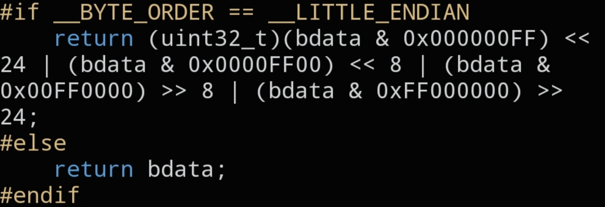

# `CNET_BIG32`

```c
static inline uint32_t CNET_BIG32(uint32_t bdata);
```



## Description

Converts a 32-bit value to Big Endian (network byte order). On a big-endian host this is a no-op; on a little-endian host the four bytes are swapped. Use it for 32-bit protocol fields (sequence numbers, addresses, ...).

## Parameters

- `uint32_t bdata` — value to convert

## Returns

`bdata` in Big Endian byte order.

## Example

```c
tcp->seq  = CNET_BIG32(123);
tcp->aseq = CNET_BIG32(0);
```
