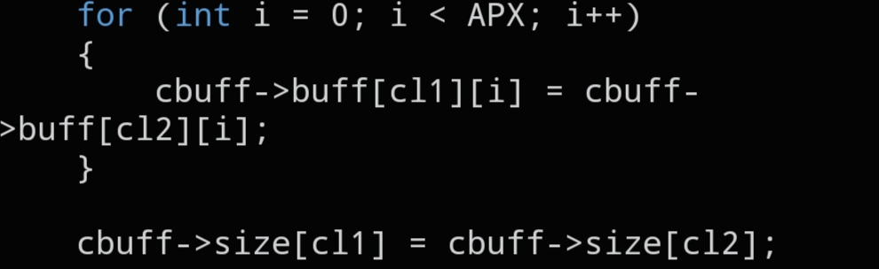

# `CNET_BUFFER_CLONE`

```c
void CNET_BUFFER_CLONE(struct cnet_buffer *cbuff, int cl1, int cl2);
```



## Description

Quickly duplicates a packet slot inside a `struct cnet_buffer`, copying both its data and its recorded size, so you don't have to rebuild an identical packet from scratch for every slot.

## Parameters

- `struct cnet_buffer *cbuff` — pointer to the packet buffer
- `int cl1` — destination slot index (**to**)
- `int cl2` — source slot index (**from**)

## See also

- `struct cnet_buffer` — `docs/structs/cnet_buffer.md`
