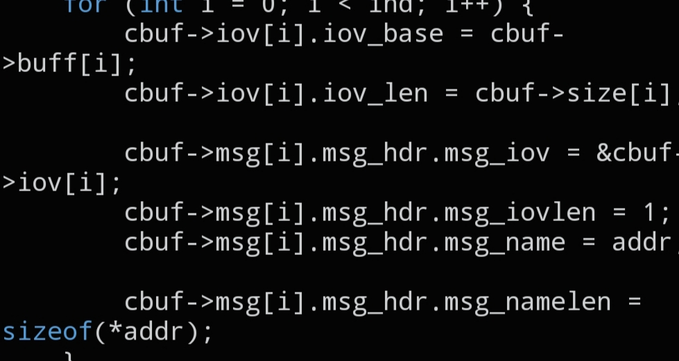

# `CNET_BUFFER_INIT_ALL`

```c
void CNET_BUFFER_INIT_ALL(struct cnet_buffer *cbuf, int ind, struct sockaddr_in *addr);
```



## Description

Configures a `struct cnet_buffer` so it's ready for `CNET_BURST()`. `_ALL` applies the given destination address to a *range* of packet slots at once — use it when every packet in that range should be sent to the same destination. If you need to configure a single slot instead, use `CNET_BUFFER_INIT_SET()`.

## Parameters

- `struct cnet_buffer *cbuf` — pointer to the packet buffer to configure
- `int ind` — starting index (or count) of the range of packet slots to configure
- `struct sockaddr_in *addr` — destination address, typically obtained from `CNET_SOCK_ADDR()`

## See also

- `CNET_BUFFER_INIT_SET()` — `docs/functions/CNET_BUFFER_INIT_SET.md`
- `CNET_SOCK_ADDR()` — `docs/functions/CNET_SOCK_ADDR.md`
- `CNET_BURST()` — `docs/functions/CNET_BURST.md`
- `struct cnet_buffer` — `docs/structs/cnet_buffer.md`
