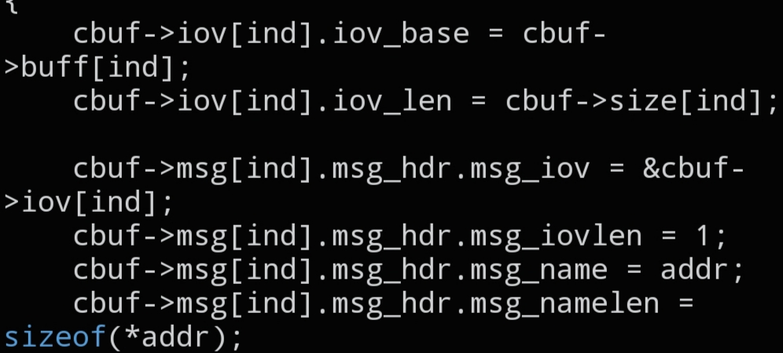

# `CNET_BUFFER_INIT_SET`

```c
void CNET_BUFFER_INIT_SET(struct cnet_buffer *cbuf, int ind, struct sockaddr_in *addr);
```



## Description

Configures a `struct cnet_buffer` so it's ready for `CNET_BURST()`. `_SET` applies the given destination address to a *single* packet slot at the given index — use it when different packets in the buffer need different destinations. To configure a whole range at once instead, use `CNET_BUFFER_INIT_ALL()`.

## Parameters

- `struct cnet_buffer *cbuf` — pointer to the packet buffer to configure
- `int ind` — index of the single packet slot to configure
- `struct sockaddr_in *addr` — destination address, typically obtained from `CNET_SOCK_ADDR()`

## See also

- `CNET_BUFFER_INIT_ALL()` — `docs/functions/CNET_BUFFER_INIT_ALL.md`
- `CNET_SOCK_ADDR()` — `docs/functions/CNET_SOCK_ADDR.md`
- `CNET_BURST()` — `docs/functions/CNET_BURST.md`
- `struct cnet_buffer` — `docs/structs/cnet_buffer.md`
