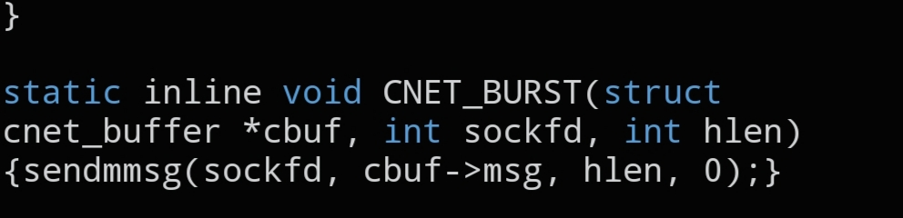

# `CNET_BURST`

```c
static inline void CNET_BURST(struct cnet_buffer *cbuf, int sockfd, int hlen);
```



## Description

Sends every configured packet in a `struct cnet_buffer` back to back, optimized for throughput. A single call can send at most 64 raw packets.

## Parameters

- `struct cnet_buffer *cbuf` — pointer to the buffer holding the packets to send
- `int sockfd` — socket descriptor to send on, obtained from `CNET_SOCK()`
- `int hlen` — number of packets from the buffer to send (maximum 64)

## See also

- `CNET_SOCK()` — `docs/functions/CNET_SOCK.md`
- `struct cnet_buffer` — `docs/structs/cnet_buffer.md`
