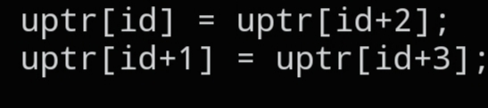

# `CNET_DIRECT_SWAP32`

```c
static inline void CNET_DIRECT_SWAP32(uint8_t *uptr, size_t id);
```



## Description

Byte-swaps a 32-bit value in place, directly inside a raw byte buffer, instead of taking/returning a `uint32_t` like `CNET_BIG32()` does. Useful when you're working with a packet as a flat `uint8_t *` array and don't want to cast a sub-region into its own struct field first.

## Parameters

- `uint8_t *uptr` — pointer to the byte buffer that holds the packet data (e.g. `uint8_t *bytes = (uint8_t *)data;` — a cast from a `void *` or any other pointer to raw bytes)
- `size_t id` — byte offset of the first byte of the 32-bit value to swap

## See also

- `CNET_BIG32()` — `docs/functions/CNET_BIG32.md`
