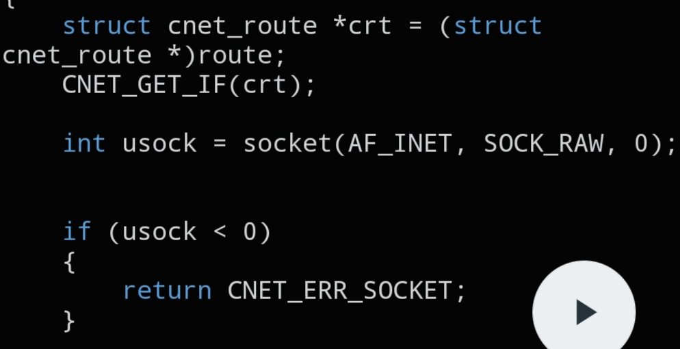

# `CNET_GET_IF`

```c
cnet_errno_t CNET_GET_IF(void *crt);
```



## Description

Looks up the first available network interface (skipping loopback and down interfaces) and stores its name into the `iface` field of the given `struct cnet_route`.

## Parameters

- `void *crt` — pointer to a `struct cnet_route` (cast to `void *`) that will receive the interface name

## Returns

A `cnet_errno_t` status code indicating success or the reason the lookup failed.

## See also

- `struct cnet_route` — `docs/structs/cnet_route.md`
- second half of the implementation — `assets/get_if2.jpg`
