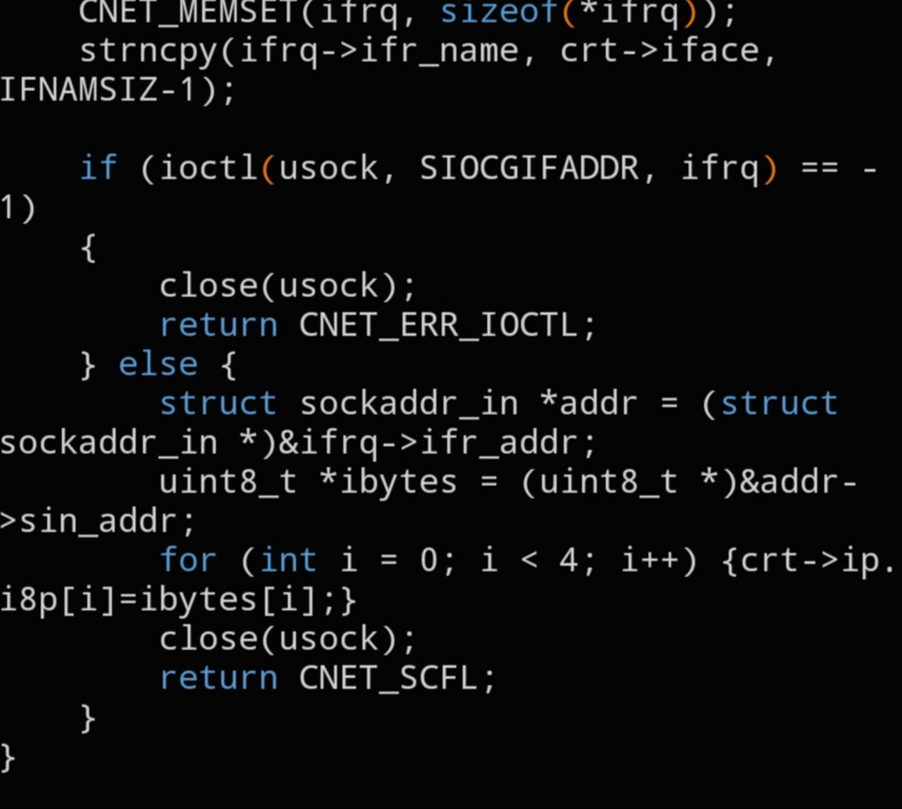

# `CNET_GET_IP`

```c
cnet_errno_t CNET_GET_IP(void *route);
```



## Description

Resolves the local machine's IP address for the interface stored in `struct cnet_route` and writes it back into that same structure.

## Parameters

- `void *route` — pointer to a `struct cnet_route` (cast to `void *`) that will receive the local IP address

## Returns

A `cnet_errno_t` status code indicating success or the reason the lookup failed.

## See also

- `struct cnet_route` — `docs/structs/cnet_route.md`
