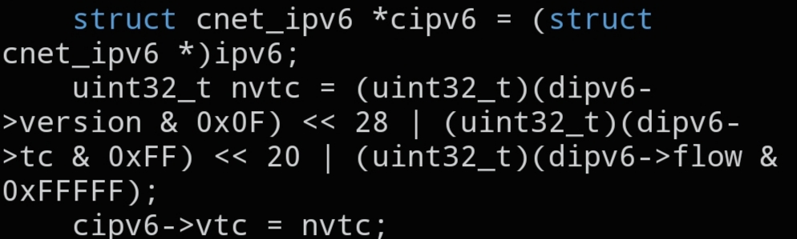

# `CNET_IPV6_VTC`

```c
static inline void CNET_IPV6_VTC(void *ipv6, struct cnet_dipv6 *dipv6);
```



## Description

Packs the IPv6 header's combined Version / Traffic Class / Flow Label field (`vtc`, a `uint32_t`) from the individual integer values held in a `struct cnet_dipv6`, and writes the result directly into the target IPv6 header.

## Parameters

- `void *ipv6` — pointer to the IPv6 header struct whose `vtc` field will be set
- `struct cnet_dipv6 *dipv6` — pointer to the struct holding the decomposed version / traffic class / flow label values that will be packed and written into `ipv6`

## See also

- `struct cnet_dipv6` — `docs/structs/cnet.md`
