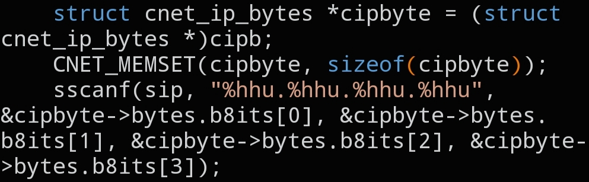

# `CNET_IP_BYTES`

```c
void CNET_IP_BYTES(void *cipb, char sip[]);
```



## Description

Parses a dotted-decimal IP string (e.g. `"192.168.0.1"`) into raw bytes and writes them into `struct cnet_ip_bytes->bytes->b8its`. Because `b8its` shares a union with `b32its`, the same address is immediately available as a single `uint32_t` too — handy when a header field expects the address in that form.

## Parameters

- `void *cipb` — pointer to the destination `struct cnet_ip_bytes` (cast to `void *`)
- `char sip[]` — the IP address as a dotted-decimal string

## See also

- `struct cnet_ip_bytes` — `docs/structs/cnet_ip.md`
