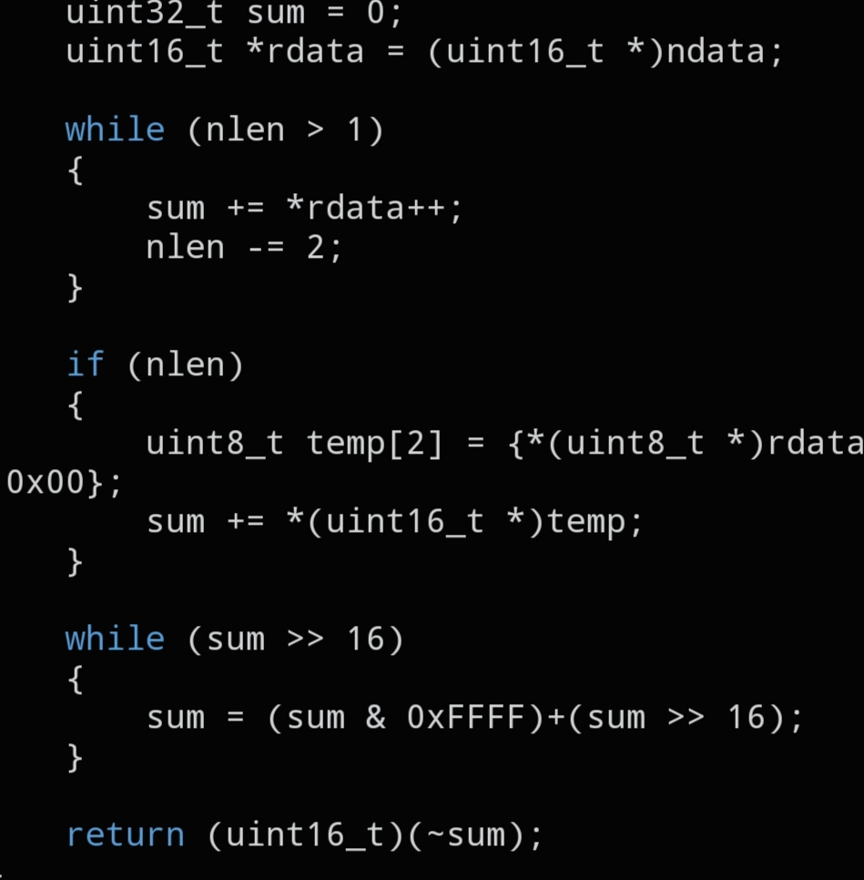

# `CNET_L3_CSUM`

```c
uint16_t CNET_L3_CSUM(void *ndata, size_t nlen);
```



## Description

Computes the Internet checksum (RFC 1071) for a Layer 3 header, such as `struct cnet_ip`. Use this after filling in every field of the IP header except the checksum itself.

## Parameters

- `void *ndata` — pointer to the L3 header to checksum (typically a `struct cnet_ip *`)
- `size_t nlen` — length in bytes of the header pointed to by `ndata` (usually `sizeof(struct cnet_ip)`)

## Returns

The computed 16-bit checksum, ready to be written into the header's checksum field.

## Example

```c
struct cnet_ip ip = {0};
// ... fill in ip fields ...
ip.csum = CNET_L3_CSUM(&ip, sizeof(ip));
```

## See also

- `struct cnet_ip` — `docs/structs/cnet_ip.md`
