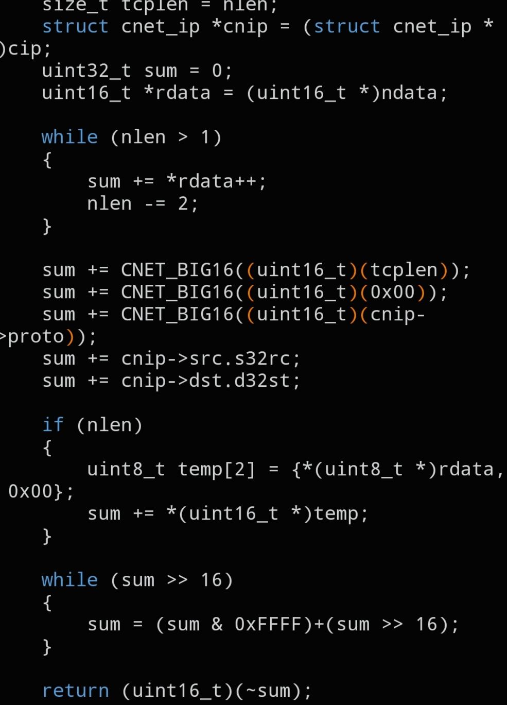

# `CNET_L4_CSUM`

```c
uint16_t CNET_L4_CSUM(void *cip, void *ndata, size_t nlen);
```



## Description

Computes the checksum for a Layer 4 header (TCP, UDP or ICMP). Unlike the L3 checksum, this one is calculated over a pseudo-header built from the IP header plus the L4 payload, so the IP header is required as well.

## Parameters

- `void *cip` — pointer to the already-filled `struct cnet_ip`
- `void *ndata` — pointer to the L4 header/payload to checksum (`struct cnet_tcp *`, `cnet_udp *`, or `cnet_icmp *`)
- `size_t nlen` — length in bytes of the structure pointed to by `ndata`

## Returns

The computed 16-bit checksum for the L4 header.

## See also

- `struct cnet_ip` — `docs/structs/cnet_ip.md`
- `struct cnet_tcp` / `cnet_udp` / `cnet_icmp` — `docs/structs/cnet_tcp.md, docs/structs/cnet_udp.md, docs/structs/cnet_icmp.md`
