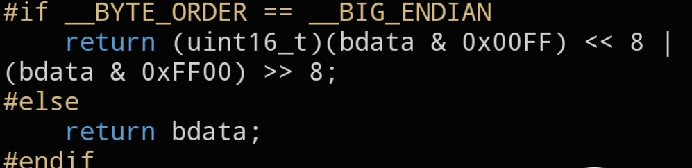

# `CNET_LITTLE16`

```c
static inline uint16_t CNET_LITTLE16(uint16_t bdata);
```



## Description

Converts a 16-bit value to Little Endian. On a little-endian host this is a no-op; on a big-endian host the two bytes are swapped. This is the mirror image of `CNET_BIG16()`.

## Parameters

- `uint16_t bdata` — value to convert

## Returns

`bdata` in Little Endian byte order.

## See also

- `CNET_BIG16()` — `docs/functions/CNET_BIG16.md`
