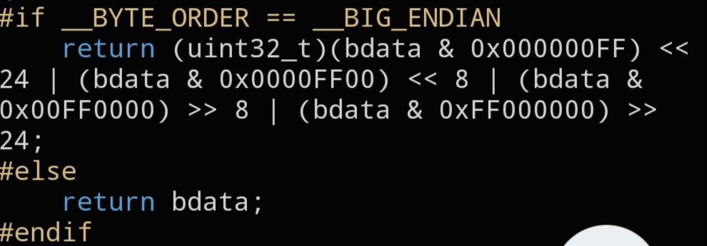

# `CNET_LITTLE32`

```c
static inline uint32_t CNET_LITTLE32(uint32_t bdata);
```



## Description

Converts a 32-bit value to Little Endian. On a little-endian host this is a no-op; on a big-endian host the four bytes are swapped. This is the mirror image of `CNET_BIG32()`.

## Parameters

- `uint32_t bdata` — value to convert

## Returns

`bdata` in Little Endian byte order.

## See also

- `CNET_BIG32()` — `docs/functions/CNET_BIG32.md`
