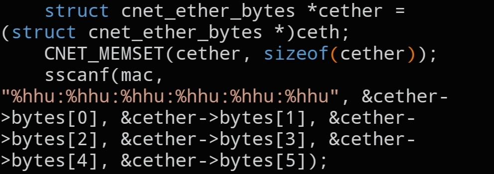

# `CNET_MAC_BYTES`

```c
void CNET_MAC_BYTES(void *ceth, char mac[]);
```



## Description

Parses a colon-separated MAC address string (e.g. `"ff:ff:ff:ff:ff:ff"` for the broadcast address) into raw bytes and writes them into `struct cnet_ether_bytes->bytes`.

## Parameters

- `void *ceth` — pointer to the destination `struct cnet_ether_bytes` (cast to `void *`)
- `char mac[]` — the MAC address as a colon-separated string

## See also

- `struct cnet_ether_bytes` — `docs/structs/cnet_ether.md`
