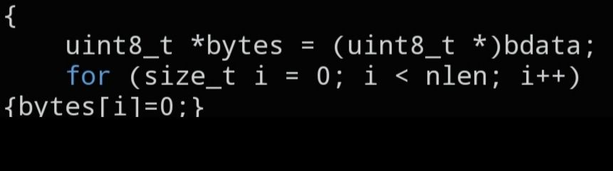

# `CNET_MEMSET`

```c
static inline void CNET_MEMSET(void *cstruct, size_t nlen);
```



## Description

A lightweight, two-argument stand-in for `memset()` from `stdlib.h`, always zero-filling the target. It saves you from typing the `0` fill-byte argument every time you just want to zero out a struct before filling it in.

`CNET_MEMSET(&ip, sizeof(ip))` is equivalent to `memset(&ip, 0, sizeof(ip))`.

## Parameters

- `void *cstruct` — pointer to the memory region to zero out
- `size_t nlen` — number of bytes to zero, starting at `cstruct`
