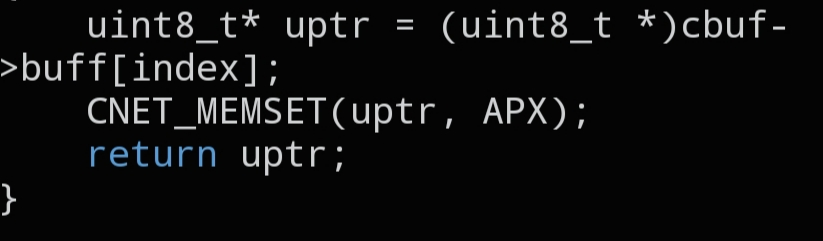

# `CNET_PACKET_UPTR`

```c
static inline uint8_t *CNET_PACKET_UPTR(struct cnet_buffer *cbuf, int index);
```



## Description

Returns a raw `uint8_t *` pointer into a specific packet slot of a `struct cnet_buffer`, so you can cast it to whatever protocol struct you need and fill it in directly.

## Parameters

- `struct cnet_buffer *cbuf` — pointer to the packet buffer
- `int index` — slot index inside the buffer (0-63, see `CNET_BURST()` for the 64-packet limit)

## Returns

A `uint8_t *` pointing at the start of the requested packet slot.

## Example

```c
uint8_t *pkt = CNET_PACKET_UPTR(&buff, 0);
struct cnet_ip *ip = (struct cnet_ip *)pkt;
```

## See also

- `struct cnet_ip` — `docs/structs/cnet_ip.md`
- `struct cnet_buffer` — `docs/structs/cnet_buffer.md`
