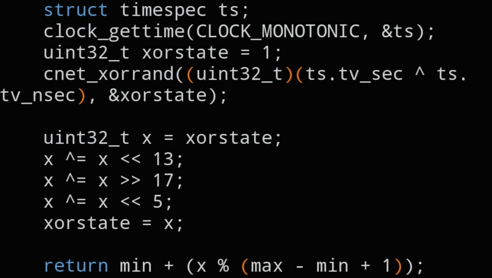

# `CNET_RAND`

```c
int CNET_RAND(int min, int max);
```



## Description

Thread-safe replacement for `rand()`. Instead of relying on libc's global, non-reentrant PRNG state, `CNET_RAND()` seeds a local xorshift generator (see `cnet_xorrand()`) from `CLOCK_MONOTONIC`, so it can be called safely from multiple threads without external locking.

Returns a pseudo-random integer in the inclusive range `[min, max]`.

## Parameters

- `int min` — lower bound of the range (inclusive)
- `int max` — upper bound of the range (inclusive)

## Returns

A pseudo-random `int` in `[min, max]`.

## See also

- `cnet_xorrand()` internals — `docs/functions/unuseable.md`
