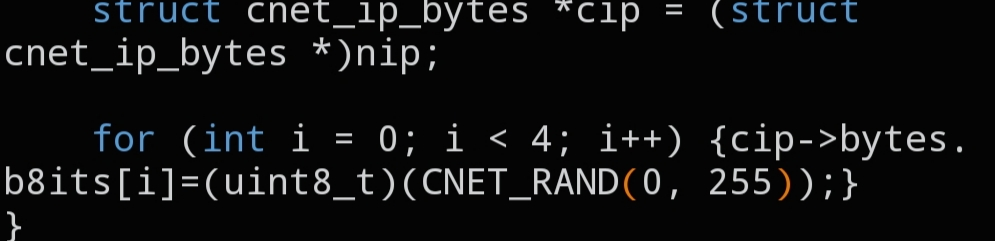

# `CNET_RAND_IP`

```c
static inline void CNET_RAND_IP(void *nip);
```



## Description

Generates a random IPv4 address and writes it into a `struct cnet_ip_bytes`. The four random bytes are written to `bytes->b8its`; because `b8its` and `b32its` share a union, the same address is immediately available as a single `uint32_t` as well.

## Parameters

- `void *nip` — pointer to the destination `struct cnet_ip_bytes` (cast to `void *`)

## See also

- `struct cnet_ip_bytes` — `docs/structs/cnet_ip.md`
