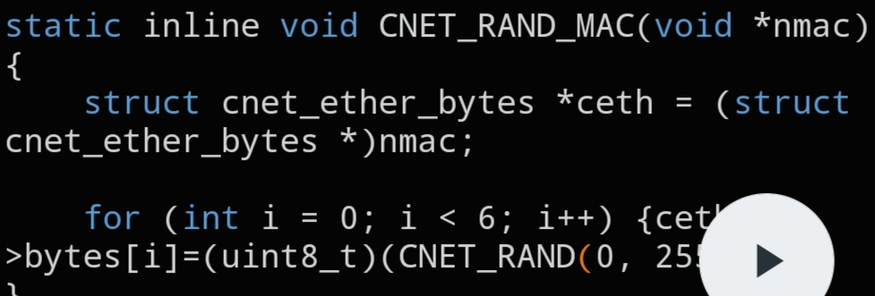

# `CNET_RAND_MAC`

```c
static inline void CNET_RAND_MAC(void *nmac);
```



## Description

Generates a random MAC address and writes the six random bytes into `struct cnet_ether_bytes->bytes`.

## Parameters

- `void *nmac` — pointer to the destination `struct cnet_ether_bytes` (cast to `void *`)

## See also

- `struct cnet_ether_bytes` — `docs/structs/cnet_ether.md`
