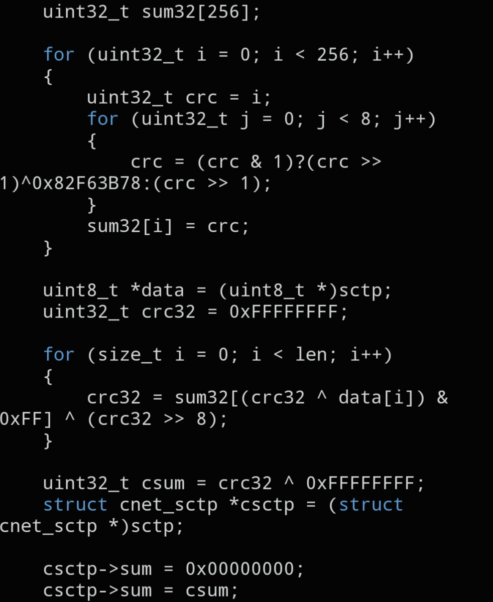

# `CNET_SCTP_CSUM`

```c
void CNET_SCTP_CSUM(void *sctp, size_t len);
```



## Description

Computes and writes the CRC32c checksum required by the SCTP protocol directly into the given `struct cnet_sctp` header. Unlike `CNET_L3_CSUM`/`CNET_L4_CSUM`, this function writes the result in place instead of returning it.

## Parameters

- `void *sctp` — pointer to the `struct cnet_sctp` to checksum
- `size_t len` — length in bytes of the SCTP structure

## See also

- `struct cnet_sctp` — `docs/structs/cnet_sctp.md`
