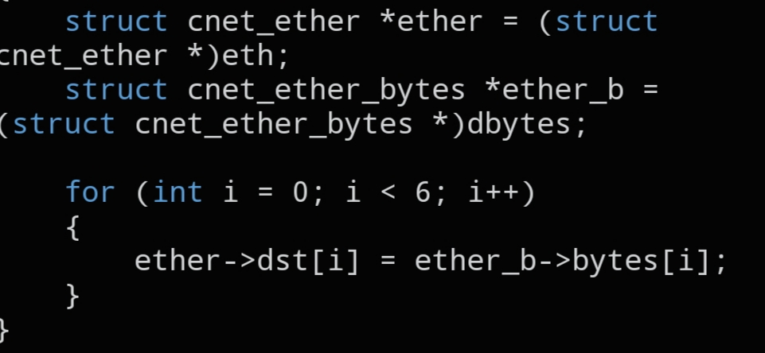

# `CNET_SET_DMAC`

```c
static inline void CNET_SET_DMAC(void *eth, void *dbytes);
```



## Description

Copies a destination MAC address from a `struct cnet_ether_bytes` into the `dmac` field of a `struct cnet_ether` header — a quick helper so you don't have to `memcpy()` the six bytes by hand every time.

## Parameters

- `void *eth` — pointer to the destination `struct cnet_ether`
- `void *dbytes` — pointer to the source `struct cnet_ether_bytes` holding the MAC to copy in

## See also

- `struct cnet_ether` — `docs/structs/cnet_ether.md`
- `struct cnet_ether_bytes` — `docs/structs/cnet_ether.md`
- `CNET_SET_SMAC()` — `docs/functions/CNET_SET_SMAC.md`
