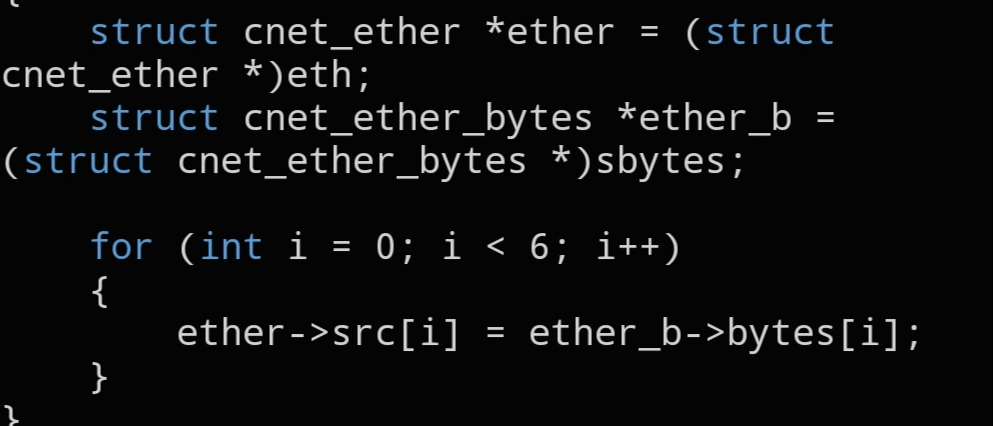

# `CNET_SET_SMAC`

```c
static inline void CNET_SET_SMAC(void *eth, void *sbytes);
```



## Description

Copies a source MAC address from a `struct cnet_ether_bytes` into the `smac` field of a `struct cnet_ether` header — a quick helper so you don't have to `memcpy()` the six bytes by hand every time.

## Parameters

- `void *eth` — pointer to the destination `struct cnet_ether`
- `void *sbytes` — pointer to the source `struct cnet_ether_bytes` holding the MAC to copy in

## See also

- `struct cnet_ether` — `docs/structs/cnet_ether.md`
- `struct cnet_ether_bytes` — `docs/structs/cnet_ether.md`
- `CNET_SET_DMAC()` — `docs/functions/CNET_SET_DMAC.md`
