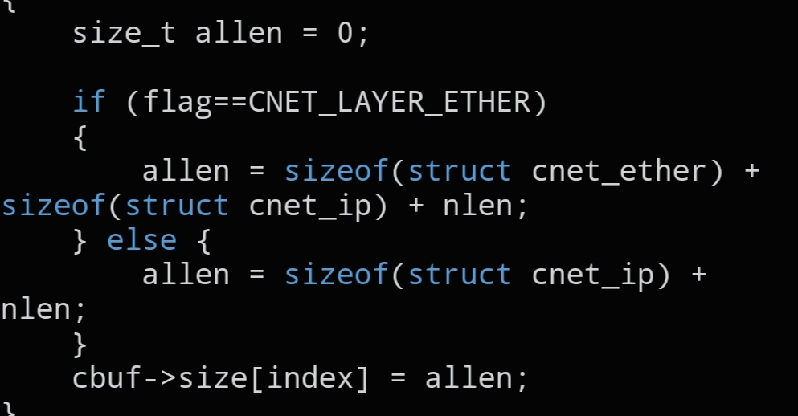

# `CNET_SIZE_SET`

```c
static inline void CNET_SIZE_SET(struct cnet_buffer *cbuf, int index, size_t nlen, int flag);
```



## Description

Records the size of one packet slot inside a `struct cnet_buffer`, so `CNET_BURST()` knows exactly how many bytes to send for that slot.

## Parameters

- `struct cnet_buffer *cbuf` — pointer to the packet buffer to update
- `int index` — which of the (up to 64) packet slots to set the size for
- `size_t nlen` — size in bytes of the protocol payload (e.g. `sizeof(struct cnet_tcp)`)
- `int flag` — socket layer the size applies to — `CNET_LAYER_ETHER` or `CNET_LAYER_IP`

## See also

- `struct cnet_buffer` — `docs/structs/cnet_buffer.md`
- `CNET_BURST()` — `docs/functions/CNET_BURST.md`
