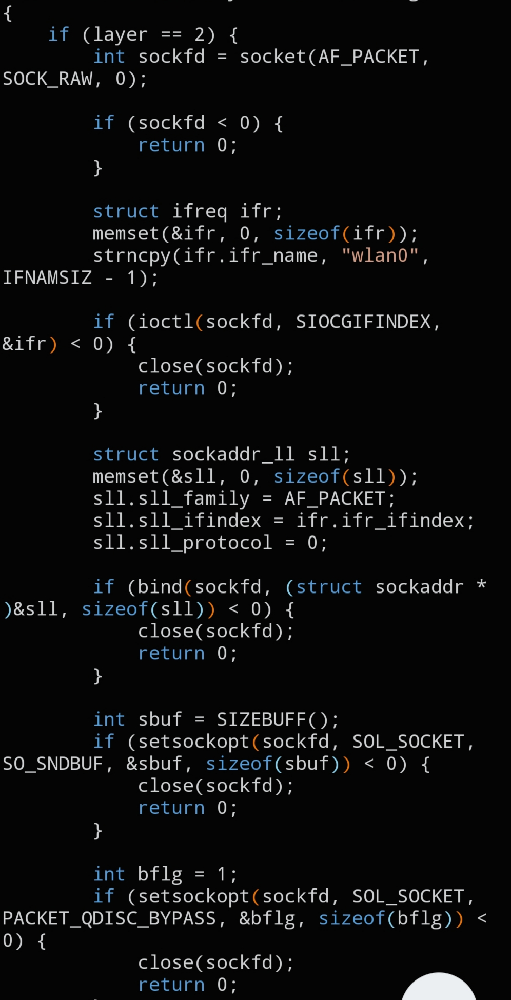

# `CNET_SOCK`

```c
int CNET_SOCK(int layer, int flag);
```



## Description

Quickly creates a raw socket descriptor configured for the layer and protocol you need, hiding the usual `socket()` / `setsockopt()` boilerplate.

## Parameters

- `int layer` — `CNET_LAYER_IP` or `CNET_LAYER_ETHER`
- `int flag` — protocol flag; ignored (`0`) for `CNET_LAYER_ETHER`, otherwise one of `CNET_IP_UDP`, `CNET_IP_TCP`, `CNET_IP_ICMP`, etc. for `CNET_LAYER_IP`

## Returns

A socket file descriptor ready to use with `CNET_BURST()`, or an error indicator on failure.

## Example

```c
int sockfd = CNET_SOCK(CNET_LAYER_IP, CNET_IP_TCP);
int sockfd = CNET_SOCK(CNET_LAYER_ETHER, 0);
```

## See also

- continuation of the implementation — `assets/sock_2.jpg`
